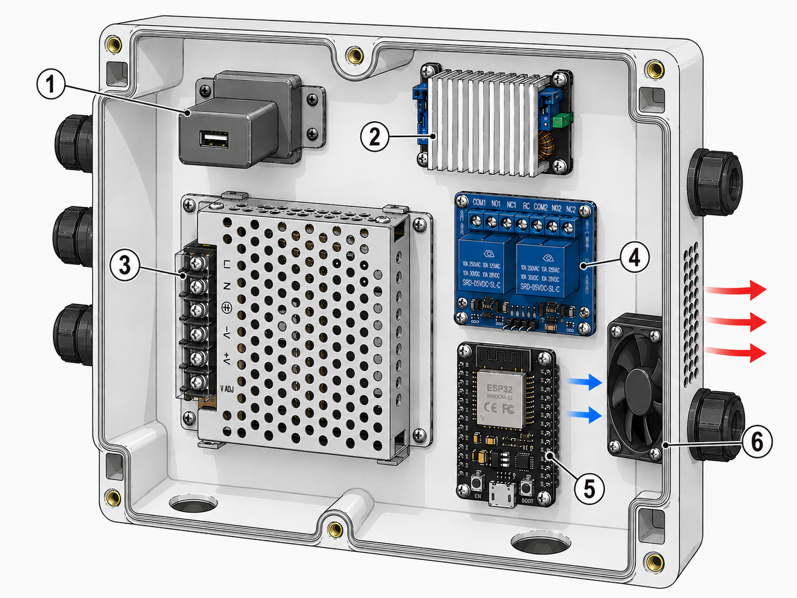
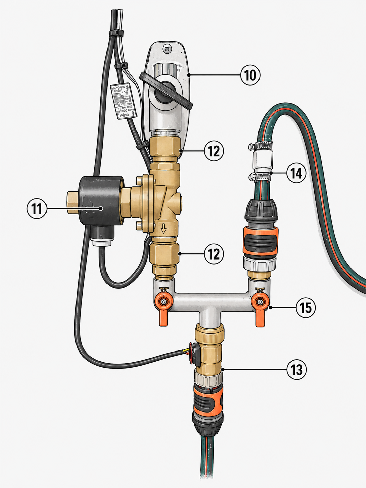
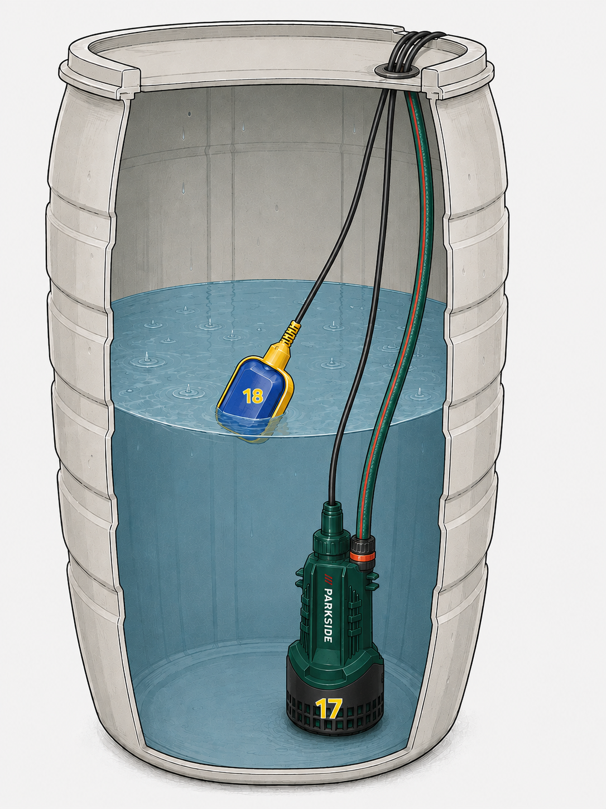
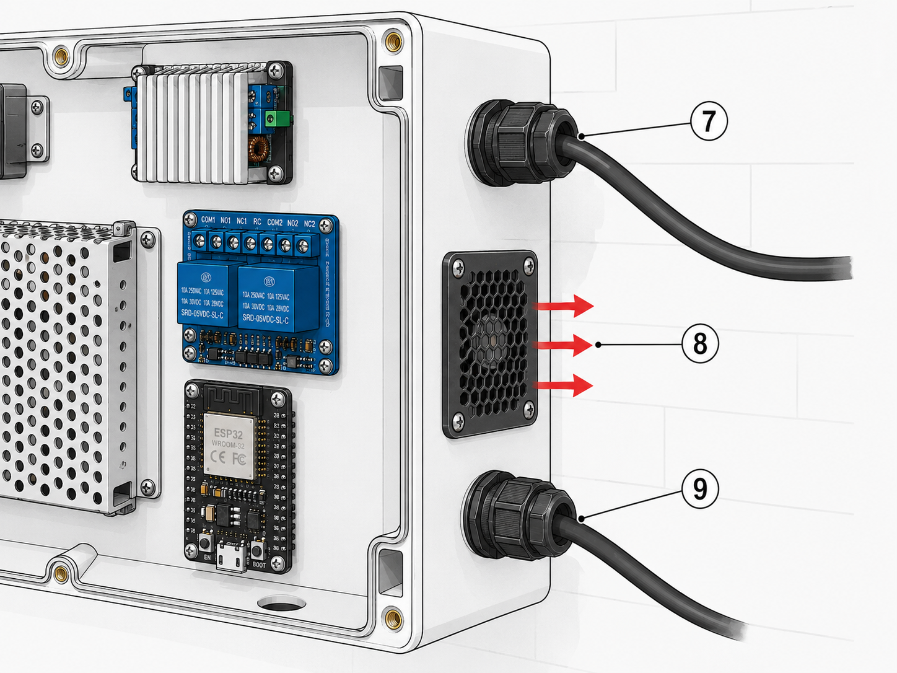
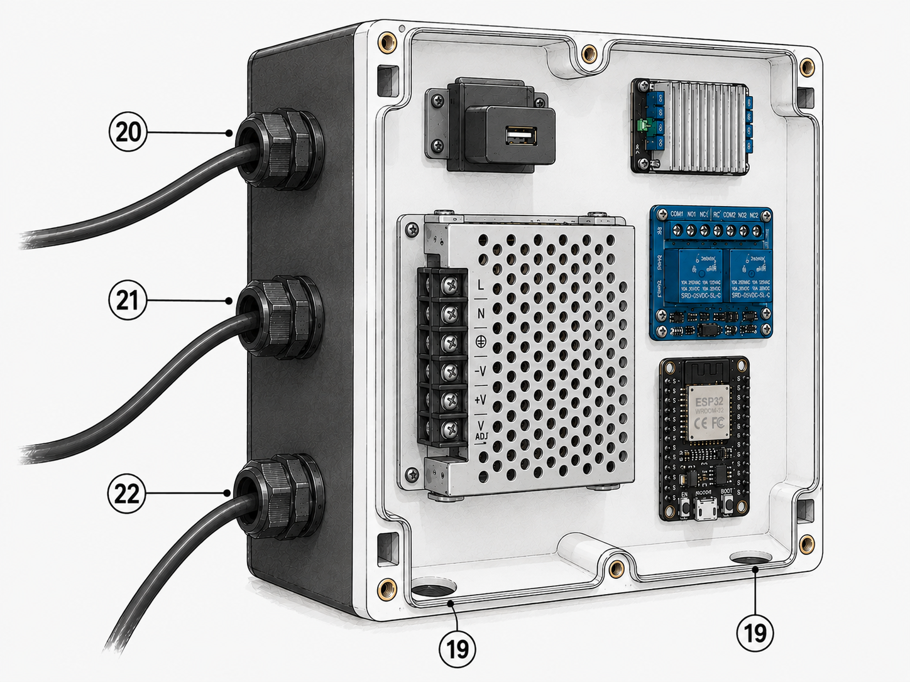

# Rain Barrel Pump Automation

An ESPHome + Home Assistant project that automatically switches a rain
barrel pump to supply water to the garden/sprinklers. Whenever water
is drawn downstream (detected via a flow sensor), this system activates
a pump + solenoid valve to deliver water from the rain barrel — provided
the barrel is not empty. Includes built-in safety features for leak
detection, a stuck pump, and overheating.

> **Disclaimer:** these instructions and illustrations were generated with the help of
> Claude and ChatGPT after the build was completed, based on the working
> setup. The manual is not idiot proof - keep on thinking. The author accepts no responsibility for damage, leaks,
> electrical problems or other consequences of replicating this project.
> Always work safely with electricity and water.

## How it works

1. A **flow sensor** in the main water line to the garden/sprinklers
   detects when water is being drawn.
2. When flow is detected (> 1 L/min) and the **float switch** in the
   rain barrel indicates water is present, the **solenoid valve** closes
   the tap and (2 seconds later) the **pump** starts — delivering rain
   water instead of tap water.
3. When flow stops (< 1 L/min), both pump and valve turn off and the
   tap supplies water again.
4. If the barrel runs dry during use (float → off), pump and valve stop
   immediately and you receive a notification. When water returns
   (float → on), another notification is sent.
5. A set of safety automations monitors the rest: leak detection (too
   high flow), a pump running too long, the solenoid valve out of sync
   with the pump, and an overheating ESP32 enclosure.

## Required hardware

Numbers below (①, ②, …) refer to the callouts in the photos — real
annotated photos are in [`photos/`](photos/), full-resolution originals
in [`photos/raw/`](photos/raw/).

### Electronics



*1 USB 5V supply · 2 Buck converter (20V) · 3 24V power supply · 4 Relay module · 5 ESP32 · 6 Fan*

| # | Component | Specifications | Source |
|---|---|---|---|
| 1 | 5V USB power supply | separate supply for ESP32, isolated from 24V circuit | Any 5V 1A+ USB charger |
| 2 | Buck converter 20V | adjustable DC-DC, 20A/300W | [Amazon](https://www.amazon.nl/dp/B09KC2FNLB) |
| 3 | 24V 5A switching power supply | open frame, 120W | [Amazon](https://www.amazon.nl/dp/B0BX2GF5QY) |
| 4 | 2-channel 5V relay module | with optocoupler, active-low | [Amazon](https://www.amazon.nl/dp/B00E0NTPP4) |
| 5 | ESP32 WROOM-32 | dev board with USB-C | [Amazon](https://www.amazon.nl/dp/B0D4QZ9CKD) |
| 6 | 30mm 5V PWM fan | for enclosure cooling — fan itself (interior) | electronics supplier |

### Plumbing



*10 Wall tap · 11 Solenoid valve · 12 Swivel couplings (×2) · 13 Flow sensor · 14 Non-return valve · 15 Manifold*

| # | Component | Specifications | Source |
|---|---|---|---|
| 10 | Wall tap | existing mains water supply | — |
| 11 | 24V DC NO solenoid valve Heschen 2WK200-20 | ¾" brass, normally open | [Amazon](https://www.amazon.nl/-/en/Heschen-Electric-Solenoid-2WK200-20-Normally/dp/B072C5ZCXJ) |
| 12 | ¾" swivel coupling M×F (×2) | between tap–valve and valve–manifold, allows mounting without rotating pipe | [Amazon](https://www.amazon.nl/dp/B0CPPVSBLK]) |
| 13 | ¾" brass flow sensor | YF-S201 variant, ~444 pulses/litre | [Amazon](https://www.amazon.nl/dp/B0DP93BWWJ) |
| 14 | Garden hose non-return valve | in pump outlet, prevents backflow | [Amazon](https://www.amazon.nl/Terugslagklep-van-Kunststof-voor-Tuinslang/dp/B099F2H24F) |
| 15 | ¾" brass Y-piece / manifold (Bradas) | 2 inputs, 1 output, manual shutoff per branch | [Bol.com](https://www.bol.com/nl/nl/p/verdeler-splitter-messing-2-aftakkingen-3-4/9300000044146766/) |

### Rain barrel
This project uses a **Parkside PTBP 20-Li** cordless rain barrel pump,
which normally runs on a 20V lithium battery pack. In reality, the battery supplies 19V. 
In this setup the
battery is replaced by an adjustable buck converter supplying 19V  / 5A from
the 24V power supply. The pump cable is connected directly to the buck
converter output.

Note: the pump is designed for manual use with a battery. By connecting
it to a fixed power supply you lose the built-in battery protection.
Use a buck converter with sufficient current capacity (minimum 4A at
20V).



*17 Parkside PRPA 20-Li B3 pump — modified to run on fixed 20V DC · 18 Float switch — hangs from barrel rim, signals when barrel is empty*

| # | Component | Specifications | Source |
|---|---|---|---|
| 17 | Parkside PRPA 20-Li B3 pump | 20V cordless rain barrel pump, modified for fixed 20V DC via buck converter | Lidl |
| 18 | Float switch | dry contact, 3 wires (COM/NO/NC) | [Amazon](https://www.amazon.nl/dp/B09XXHY7C9) |

### Enclosure & installation



*7 Pump cable gland · 8 Fan outlet with fly mesh · 9 Float switch cable gland*



*19 Ventilation air inlet with fly mesh (×2, bottom) · 20 230V mains entry · 21 Flow sensor cable · 22 Valve cable*

| # | Component | Specifications | Source |
|---|---|---|---|
| — | Weatherproof enclosure | large enough for PSU + electronics. Ventilation holes mean it's no longer fully IP-rated — condensation is the main risk | [Amazon](https://www.amazon.nl/dp/B0983N1KGF) |
| 7 | Cable gland — pump | watertight entry for 20V pump power cable | [Amazon](https://www.amazon.nl/dp/B07QTG9G3W) |
| 8 | Fan outlet & fly mesh | unfortunately not water proof | Hardware store |
| 9 | Cable gland — float switch | watertight entry for float switch wiring | [Amazon](https://www.amazon.nl/dp/B07QTG9G3W) |
| 19 | Ventilation inlet with fly mesh | bottom of enclosure, plastic cover cap prevents direct splash ingress, unfortunately not water proof | hardware store |
| 20 | Cable gland — 230V mains | watertight entry for mains power (IEC C13 printer cable, cut and wired directly) | [Amazon](https://www.amazon.nl/dp/B07QTG9G3W) |
| 21 | Cable gland — flow sensor | watertight entry for flow sensor signal cable | [Amazon](https://www.amazon.nl/dp/B07QTG9G3W) |
| 22 | Cable gland — valve | watertight entry for solenoid valve cable | [Amazon](https://www.amazon.nl/dp/B07QTG9G3W) |
| — | Mains cable (IEC C13 printer cable) | 3-wire with earth, outdoor rated, cut and wired directly to 24V supply | repurposed |

### Sundries & tools

Wago 221 connectors (assorted) · terminal blocks (schroefklemmenblokken)
· PCB standoffs + screws (assortment box) · cable ferrules + crimping
tool · jumper cables (FF, MF, MM) + dupont connectors + crimping tool ·
loose wire (e.g. speaker cable) · 230V wire for USB supply connection ·
soldering iron · multimeter · heat shrink tubing · cable ties · PTFE
tape · hot glue gun · step drill bit (for ventilation holes)

## Wiring diagram

```
230V mains
    │
    ├── 24V power supply (120W)
    │       │
    │       ├── Buck converter → 20V → Relay COM1 → Pump (+)
    │       │                          Pump (−) → 24V GND
    │       │
    │       └── Relay COM2 → Solenoid valve (+)
    │                        Solenoid valve (−) → 24V GND
    │
    └── 5V USB power supply → ESP32 (USB-C)
                                  │
                                  ├── 5V pin → Wago → Relay VCC
                                  │                   Flow sensor red
                                  │                   Fan red
                                  │
                                  ├── GND → Wago → Relay GND + BGND (24V GND)
                                  │                Flow sensor black
                                  │                Float switch black
                                  │                Fan black
                                  │
                                  ├── GPIO5  → Float switch signal (blue)
                                  ├── GPIO13 → Flow sensor yellow
                                  ├── GPIO19 → Relay IN1 (solenoid valve)
                                  ├── GPIO21 → Relay IN2 (pump)
                                  └── GPIO23 → Fan blue (PWM)
```

**Important:** Use a **separate 5V USB power supply** for the ESP32
— not the 24V supply via a buck converter. A pump draws a large inrush
current on startup that temporarily overloads the 24V supply; if the
ESP32 is on the same supply it will reset.

## Plumbing diagram

```
Tap (wall tap)
    │
    └── Solenoid valve (NO, open when pump is off)
            │
            └── Y-piece / manifold ¾"  ←── Non-return valve ←── Pump (from rain barrel)
                    │
                    └── Flow sensor ¾"
                            │
                            └── Distribution manifold
                                    ├── Sprinklers
                                    └── Garden hose
```

**Flow direction:** the tap supplies water by default through the open
solenoid valve. When the pump takes over, the solenoid valve closes the
tap. The non-return valve in the pump outlet prevents tap water from
flowing back into the barrel when the pump is off.

## ESPHome entities (from `esphome/rain-barrel.yaml`)

| Component | Role | GPIO | HA domain |
|---|---|---|---|
| ESP32 dev board (`esp32dev`) | system brain | — | — |
| Flow sensor, ~444 pulses/litre | measures flow in L/min | GPIO13 | `sensor` |
| Float switch (switches to GND) | detects whether barrel contains water | GPIO5 | `binary_sensor` |
| Relay (active-low) + NO solenoid valve | closes tap when pump is on | GPIO19 | `switch` |
| Relay (active-low) + water pump | pumps water from the barrel | GPIO21 | `switch` |
| PWM fan (via LEDC output) | cools enclosure, locally controlled above 65°C | GPIO23 | `fan` |
| ESP32 internal temperature sensor | monitors enclosure temperature | internal | `sensor` |

## Installation

1. **Flash ESPHome firmware**: copy
   [`esphome/secrets.yaml.example`](esphome/secrets.yaml.example) to
   `esphome/secrets.yaml` and fill in your WiFi credentials. Then flash
   [`esphome/rain-barrel.yaml`](esphome/rain-barrel.yaml) to your ESP32 via
   USB using `esphome run rain-barrel.yaml --device COMx` (Windows) or
   via the ESPHome add-on in Home Assistant. After the first USB flash,
   further updates work via OTA (WiFi).
2. Add the device to Home Assistant via the ESPHome integration
   (auto-discovery via zeroconf, or manually with IP address).
3. Note the entity names after adding (e.g. `sensor.regenton_water_flow`,
   `binary_sensor.regenton_float_switch`, `switch.regenton_pump`,
   `switch.regenton_solenoid_valve`, `fan.regenton_fan`,
   `sensor.regenton_esp32_temperature`) — adjust the entity IDs in
   `automations.yaml` if your names differ.
4. Copy the contents of [`automations.yaml`](automations.yaml) to your
   own `automations.yaml` (or import individual automations via the UI).
5. Copy the `template:` section from
   [`template_sensors.yaml`](template_sensors.yaml) to your
   `configuration.yaml`.
6. **Replace the placeholder notification service** — search
   `automations.yaml` for `notify.YOUR_NOTIFY_TARGET` and replace it
   with your own notify service (e.g. `notify.mobile_app_phone`).
7. Reload automations and restart HA.
8. Optional: add the card from [`dashboard.yaml`](dashboard.yaml) to
   a dashboard.

## Safety automations

- **Leak emergency stop** — flow above 6 L/min indicates a leak; pump
  off immediately, valve closed, notification sent. Adjust the threshold
  (`above: 6`) to suit your normal flow rate.
- **Pump maximum 21 minutes on** — prevents a stuck pump running
  indefinitely. Adjust the duration to what is realistic for your garden.
- **Keep pump and valve in sync** — failsafe: if the pump is on, the
  valve must also be on (open).
- **Enclosure too hot** — notification if the ESP32 enclosure exceeds
  65°C.

## Important build notes

**Power supply:** use a **separate 5V USB power supply** for the ESP32,
completely isolated from the 24V supply. A motor pump draws an inrush
current several times its normal draw on startup — this temporarily
overloads the supply and resets the ESP32 if it shares the same supply.

**Relay:** use a relay module with **active-low trigger** (low level
trigger). Add `inverted: true` in ESPHome for both relay channels.

**Solenoid valve:** choose a **normally open (NO)** valve. On power
failure the valve opens and the tap supplies water — the correct
failsafe for a garden installation. A separate non-return valve on the
tap side is not needed: the solenoid valve is always closed when the
pump is running.

**Fan:** the enclosure can heat up significantly in direct sun. A 30mm
5V PWM fan with a hole at the bottom (air inlet) and side (outlet)
keeps the temperature under control. Cover holes with fly mesh to keep
insects out and fit protective caps so water cannot enter directly. The
enclosure is no longer fully weatherproof once ventilation holes are
added — condensation is the main risk. Mount the enclosure in a sheltered
location and ensure good air circulation. Fan control runs entirely
locally on the ESP32 and does not depend on Home Assistant.

**Flow sensor calibration:** the YF-S201 produces ~450 pulses per litre.
The calibration value in ESPHome (`multiply: 0.00225`) is tuned for
this, but may vary between sensors — test with a known volume of water.

